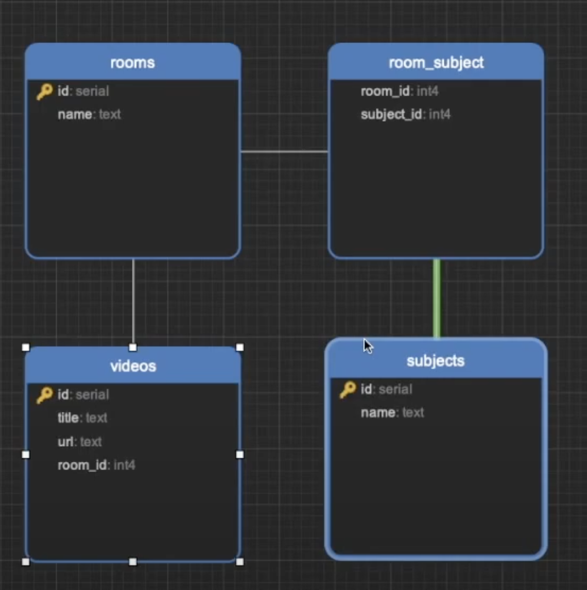

# Room System

Projeto criado com base no [vídeo do Guido Cerqueira](https://www.youtube.com/watch?v=j8cm2C5-xn8) sobre criação de uma
API com Node.js, Typescript e TypeORM.

## Requisitos

- [asdf](https://asdf-vm.com/guide/getting-started.html)

As tecnologias usadas no projeto são:

### Desenvolvimento

- Typescript: Uma linguagem de programação que adiciona recursos de tipagem estática ao JavaScript.
- Nodemon: Uma ferramenta que reinicia automaticamente o servidor quando detecta alterações nos arquivos.
- Ts-Node: Um executável que permite executar arquivos TypeScript diretamente no Node.js.
- @types/express: Um pacote que fornece definições de tipo para a biblioteca Express no TypeScript.
- @types/node: Um pacote que fornece definições de tipo para a biblioteca Node.js no TypeScript.

### Produção

- Express: Uma biblioteca para criação de aplicativos web em Node.js, facilitando a criação de APIs e manipulação de rotas.
- TypeORM: Uma biblioteca ORM que simplifica a interação com bancos de dados relacionais no Node.js.
- Pg: Driver de banco de dados para Node.js que permite a interação com bancos de dados PostgreSQL
- Dotenv: Uma biblioteca para carregar variáveis de ambiente a partir de um arquivo `.env`.
- Reflect-metadata: Uma biblioteca que adiciona suporte a metadados ao JavaScript/TypeScript, útil para frameworks como o TypeORM.

## Configuração

Execute o comando `make setup`

### Outros comandos

Para saber mais dos comandos disponíveis, execute `make help`

## Rotas

| Rota                          | Descrição                                           |
| ----------------------------- | --------------------------------------------------- |
| `GET /healthcheck`            | Rota que retorna o status do servidor               |
| `GET /subject`                | Lista todos as matérias cadastradas                 |
| `POST /subject`               | Cadastra uma nova matéria                           |
| `GET /room`                   | Lista as salas cadastradas                          |
| `POST /room`                  | Cadastra uma nova sala                              |
| `POST /room/{idRoom}/video`   | Cadastra um novo vídeo e associa a uma sala pelo ID |
| `POST /room/{idRoom}/subject` | Associa uma matéria a uma sala                      |
